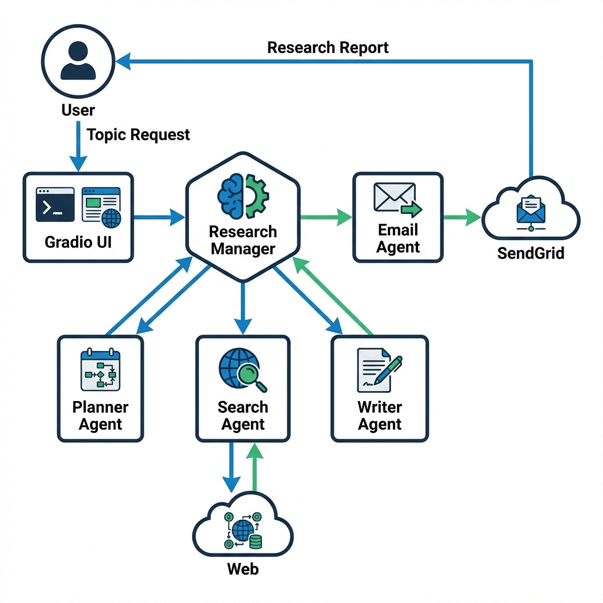

# 🕵️‍♂️ Deep Research Agent

Sistema de investigación automatizada impulsado por agentes de IA. Este proyecto utiliza una arquitectura multi-agente para realizar búsquedas profundas en la web, sintetizar grandes cantidades de información y entregar informes detallados directamente a tu correo electrónico.

## 🚀 Características

- **Orquestación Multi-Agente**: Coordina agentes especializados para planificación, búsqueda, redacción y envío de correos.
- **Investigación Autónoma**: Genera planes de búsqueda inteligentes y filtra contenido irrelevante.
- **Informes Exhaustivos**: Produce reportes en Markdown de 5-10 páginas con resúmenes ejecutivos y preguntas de seguimiento.
- **Interfaz Interactiva**: UI web sencilla y potente construida con Gradio.
- **Notificaciones por Email**: Envío automatizado del informe final con formato HTML profesional.

## 📋 Requisitos

- **Python 3.8+**
- **OpenAI API Key**: Para los modelos GPT-4o-mini.
- **SendGrid API Key**: Para el servicio de envío de correos electrónicos.

## 🛠️ Instalación y Configuración

1.  **Instalar dependencias**
    Asegúrate de estar en el directorio raíz del proyecto (donde se encuentra `requirements.txt`) y ejecuta:
    ```bash
    pip install -r requirements.txt
    ```

2.  **Configurar Variables de Entorno**
    Crea un archivo `.env` en la raíz del proyecto con tus credenciales:
    ```env
    OPENAI_API_KEY=tu_clave_api_aquí
    SENDGRID_API_KEY=tu_clave_sendgrid_aquí
    ```

3.  **Configurar Remitente de Correo**
    Tienes dos opciones para configurar las direcciones de correo:
    
    *   **Opción A (Recomendada):** Agrega las siguientes variables a tu archivo `.env`:
        ```env
        EMAIL_SENDER=tucorreo@dominio.com
        EMAIL_RECIPIENT=destinatario@dominio.com
        ```
    
    *   **Opción B:** Edita directamente el archivo `deep_research/config.py`:
        ```python
        EMAIL_SENDER = "tucorreo@dominio.com"
        EMAIL_RECIPIENT = "destinatario@dominio.com"
        ```

## ▶️ Uso

Para iniciar la aplicación, navega a la carpeta `deep_research` y ejecuta:

```bash
python deep_research.py
```

Esto lanzará una interfaz web en tu navegador predeterminado.
1. Ingresa el tema que deseas investigar en el cuadro de texto.
2. Haz clic en **"Ejecutar"**.
3. Observa el progreso en tiempo real mientras los agentes trabajan.
4. Recibe el informe final en la pantalla y en tu bandeja de entrada.

## 🏗️ Arquitectura del Sistema

El siguiente diagrama ilustra el flujo de trabajo de los agentes durante una investigación:



## 📂 Estructura del Proyecto

*   **`deep_research.py`**: Punto de entrada principal y definición de la UI con Gradio.
*   **`research_manager.py`**: El cerebro del sistema. Gestiona el flujo de trabajo y coordina a los agentes.
*   **`planner_agent.py`**: Agente responsable de desglosar la consulta en términos de búsqueda efectivos.
*   **`search_agent.py`**: Agente que navega por la web y resume los hallazgos clave.
*   **`writer_agent.py`**: Agente redactor que compila toda la información en un informe coherente.
*   **`email_agent.py`**: Agente encargado de formatear y enviar el informe por correo electrónico.

---
*Este proyecto es parte del curso "Fórmate como Ingeniero en Agentes de IA".*
